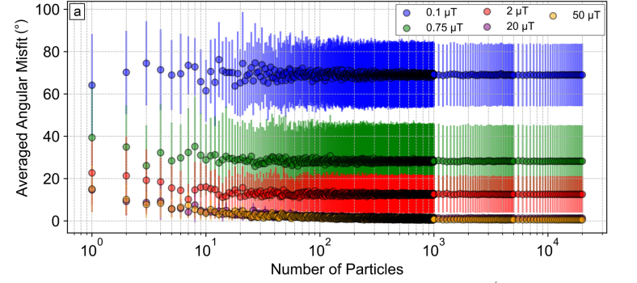
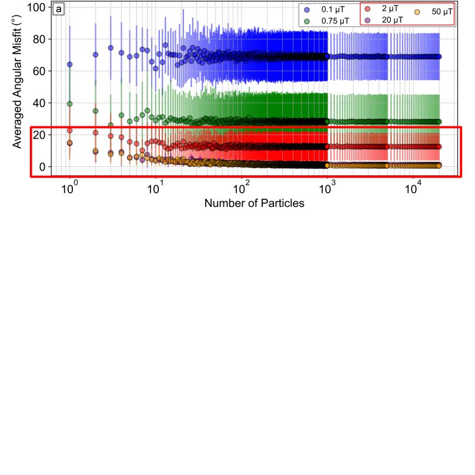
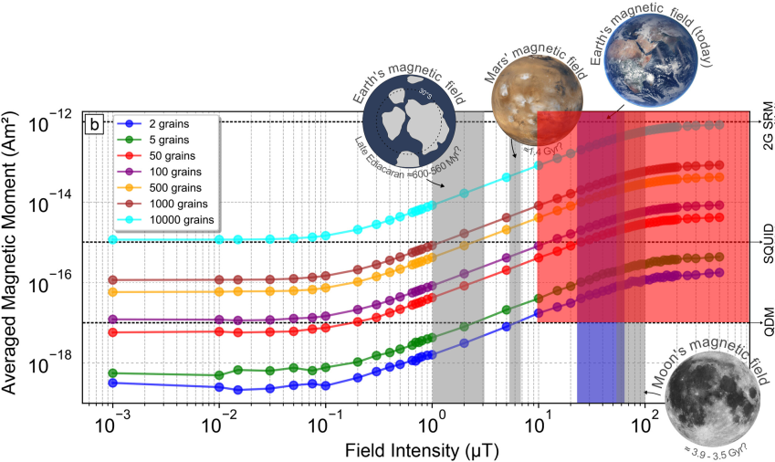
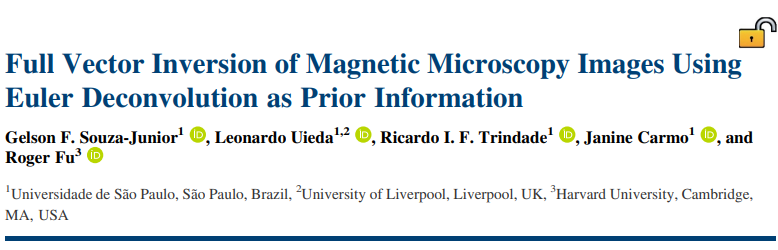

<!--
-------------------------------------------------------------------------------
This file defines the contents of each slide.
The reveal.js configuration can be found in index.html
-------------------------------------------------------------------------------
-->

<!-- .slide: class="slide-title" data-background-opacity="0.3" data-background-image="assets/magali-logo.svg" data-background-color="#000000" data-background-size="contain" -->

<!-- Place the content at the bottom of the slide -->

<h1 id="talk-title">
  
  Open-source solutions for the magnetic microscopy comunity 🧲🔬

</h1>

  <a id="talk-speaker">Yago M Castro</a>

<!-- Place location and date side-by-side with affiliation logos -->

<i class="fa fa-calendar-alt" style="margin: 0 10px 0 0"></i>
20 of October 2025

$8^{th}$ Biennial LATINMAG Meeting | Morelia, Mexico

<!-- Permission to reuse and CC-BY license logo -->
<i class="fa fa-camera" style="margin: 0 10px 0 0"></i>
Feel free to screenshot/share/reuse this presentation

<a href="https://creativecommons.org/licenses/by/4.0/"><i class="fab fa-creative-commons"></i><i class="fab fa-creative-commons-by" style="margin: 0 10px 0 2px"></i>CC-BY 4.0 License</a>

<!-- Add logos here. Need these wrappers to align them to the bottom right -->

  
  
  
  <!--  -->

===============================================================================

  

===============================================================================

  

===============================================================================

  

 

[Harvard Paleomagnetics Lab](https://paleomag.fas.harvard.edu/laboratory)

===============================================================================
<!-- .slide: class="slide-title" data-background-opacity="1" data-background-image="assets/ceramic.png"  data-background-size="contain" -->

[Souza-Junior et al 2024](https://agupubs.onlinelibrary.wiley.com/doi/10.1029/2023GC011082)

===============================================================================

===============================================================================

===============================================================================

<h1>Revisiting the Assumptions</h1>

<ul>
  <li class="fragment"><b>Bellon et al. (2025)</b> tested more realistic, <b>non-equidimensional grains</b> using micromagnetic modeling</li>
  <li class="fragment">Found that <b>grain morphology stabilizes magnetization</b> even within the “magnetically unstable zone”</li>
  <li class="fragment">Assemblages of only <b>tens to hundreds of grains</b> can produce a coherent TRM direction</li>
</ul>

[Bellon et al. (2025)](https://agupubs.onlinelibrary.wiley.com/doi/full/10.1029/2025GL114771)

===============================================================================

===============================================================================

===============================================================================

===============================================================================

===============================================================================

<!-- .slide: class="slide-title" data-background-opacity="1" data-background-image="assets/real_data.png"  data-background-size="contain" -->

===============================================================================

===============================================================================
# Needs

- Algorithms for **automatic detection** of magnetic **grains** and its **magnetic moment** determination

===============================================================================

===============================================================================
# Needs

- Algorithms for **automatic detection** of magnetic **grains** and its **magnetic moment** determination

- **Open software** for forward **modelling** and **inversion** techniques specific to magnetic microscopy 

- **Data conventions**  

===============================================================================
<!-- .slide: data-background-opacity="1" data-background-image="assets/readme-banner.png"  data-background-size="contain" data-background-color="#262626" -->

===============================================================================
<!-- .slide: data-background-opacity="0.2" data-background-image="assets/magali-logo.png"  data-background-size="contain" data-background-color="#262626" -->

What is Magali?

Free and open source 
 
<i class="fab fa-github"></i> <i class="fas fa-lock-open"></i>  <i class="fab fa-osi"></i>

Python library <i class="fab fa-python"></i>

Modelling and processing magnetic microscopy data 
 
<i class="fas fa-magnet"></i> <i class="fas fa-microscope"></i>

===============================================================================
<!-- .slide: data-background-opacity="0.2" data-background-image="assets/magali-logo.png"  data-background-size="contain" data-background-color="#262626" -->
# Why do we want to make it?

- Provide code that is **easy to use**

- Determine the **spatial positions** of **multiple** grains

- Facilitate the creation of **synthetic data**

- Propose a standard **data format**

- Serve as a **foundation** for new methods 

- Leverage the potential of emerging **magnetic microscopy** studies

===============================================================================
<section>

<pre class="compact"><code class="python" data-trim data-noescape>

import numpy as np
import magali as mg
import harmonica as hm
import skimage.exposure
import xarray as xr
import matplotlib.pyplot as plt
import ensaio

fname = ensaio.fetch_morroco_speleothem_qdm(version=1, file_format="matlab")
data = mg.read_qdm_harvard(fname)

height_difference = 5.0
data_up = (
    hm.upward_continuation(data, height_difference)
    .assign_attrs(data.attrs)
    .assign_coords(x=data.x, y=data.y)
    .assign_coords(z=data.z + height_difference)
    .rename("bz")
)

dx, dy, dz, tga = mg.gradient(data_up)
data_up["dx"], data_up["dy"], data_up["dz"], data_up["tga"] = dx, dy, dz, tga
</code></pre>
</section>

===============================================================================
<section>

<pre class="compact"><code class="python" data-trim data-noescape>

stretched = skimage.exposure.rescale_intensity(
    tga, in_range=tuple(np.percentile(tga, (1, 99)))
)
data_tga_stretched = xr.DataArray(stretched, coords=data_up.coords)

bounding_boxes = mg.detect_anomalies(
    data_tga_stretched,
    size_range=[30, 50],
    detection_threshold=0.07,
    border_exclusion=2,
)

data_updated, locations_, dipole_moments_, r2_values = mg.iterative_nonlinear_inversion(
    data_up,
    bounding_boxes,
    height_difference=height_difference,
    copy_data=True,
)

</code></pre>
</section>

===============================================================================
<section>

<pre class="compact"><code class="python" data-trim data-noescape>

locations_arr = np.array(locations_)

fig, ax = plt.subplots()

data.plot.pcolormesh(ax=ax, cmap="seismic", vmin=-5000, vmax=5000)

mg.plot_bounding_boxes(bounding_boxes, ax=ax, color="black", linewidth=1.5)

ax.scatter(
    locations_arr[:, 0],  # x
    locations_arr[:, 1],  # y
    c="green",
    marker=".",
    s=60,
    label="Dipole estimated location"
)
plt.legend()

plt.show()

</code></pre>
</section>

===============================================================================
<!-- .slide: data-background-opacity="1" data-background-image="assets/magali_code_example.png"  data-background-size="contain" data-background-color="#262626" -->

===============================================================================
# Conclusions

- Magnetic microscopy lets us investigate magnetism at the grain scale

- <strong>Magali</strong> brings automation, reproducibility, and speed to these analyses

  - It integrates open tools,

===============================================================================
# Conclusions

- Magnetic microscopy lets us investigate magnetism at the grain scale

- <strong>Magali</strong> brings automation, reproducibility, and speed to these analyses

  - It integrates open tools, FAIR data,

<b>FAIR</b>: <b>F</b>indable, <b>A</b>ccessible, <b>I</b>nteroperable and <b>R</b>eusable

===============================================================================
# Conclusions

- Magnetic microscopy lets us investigate magnetism at the grain scale

- <strong>Magali</strong> brings automation, reproducibility, and speed to these analyses

- It integrates open tools, FAIR data, and transparent workflows for magnetic research

===============================================================================
# Future work

- Provide, discuss, and establish data conventions for magnetic microscopy

- Write functions to read data from different microscope systems

- Add more datasets to <strong>Ensaio</strong> for testing and community use

- Release <strong>Magali 1.0</strong> with improved docs and structure

===============================================================================
<!-- .slide: data-background-opacity="0.2" data-background-image="assets/magali-logo.png"  data-background-size="contain" data-background-color="#262626" -->

<i class="fas fa-comments"></i>
 
Contact:
<a>yagomcastro1@gmail.com</a>

<i class="fab fa-github"></i>
 
Source code for this presentation:
 
[https://yagomcastro.github.io/magali-msc-qualification/](https://github.com/YagoMCastro/magali-msc-qualification)

<i class="fab fa-creative-commons"></i><i class="fab fa-creative-commons-by"></i>
 
Unless otherwise noted,
the contents of this presentation are
licensed under the
 
[Creative Commons Attribution 4.0 International License](https://creativecommons.org/licenses/by/4.0/).

