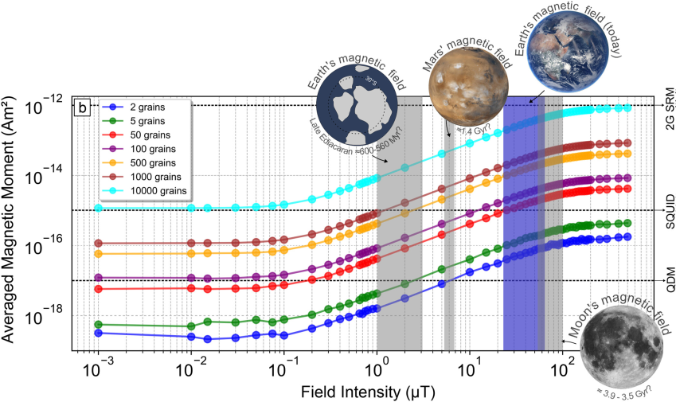

<!--
-------------------------------------------------------------------------------
This file defines the contents of each slide.
The reveal.js configuration can be found in index.html
-------------------------------------------------------------------------------
-->

<!-- .slide: class="slide-title" data-background-opacity="0.3" data-background-image="assets/magali-logo.svg" data-background-color="#000000" data-background-size="contain" -->

<!-- Place the content at the bottom of the slide -->

<h1 id="talk-title">
  
Magali: open software for inversion and analysis of magnetic microscopy data🧲🔬

</h1>

  <a id="talk-speaker"><b>Yago Moreira Castro</b></a>,
  Leonardo Uieda,
  Gelson Ferreira de Souza-Junior

<!-- Place location and date side-by-side with affiliation logos -->

<i class="fa fa-calendar-alt" style="margin: 0 10px 0 0"></i>
20 of October 2025

$8^{th}$ Biennial LATINMAG Meeting | Morelia, Mexico

<!-- Permission to reuse and CC-BY license logo -->
<i class="fa fa-camera" style="margin: 0 10px 0 0"></i>
Feel free to screenshot/share/reuse this presentation

<a href="https://creativecommons.org/licenses/by/4.0/"><i class="fab fa-creative-commons"></i><i class="fab fa-creative-commons-by" style="margin: 0 10px 0 2px"></i>CC-BY 4.0 License</a>

<!-- Add logos here. Need these wrappers to align them to the bottom right -->

  
  
  
  <!--  -->

===============================================================================

  

===============================================================================

  

===============================================================================

  

 

[Harvard Paleomagnetics Lab](https://paleomag.fas.harvard.edu/laboratory)

===============================================================================
<!-- .slide: class="slide-title" data-background-opacity="1" data-background-image="assets/ceramic.png"  data-background-size="contain" -->

[Souza-Junior et al 2024](https://agupubs.onlinelibrary.wiley.com/doi/10.1029/2023GC011082)

===============================================================================

===============================================================================

===============================================================================

- Bellon et al. (2025) modeled vortex-state grains, a more realistic scenario, using micromagnetic simulations.

- <b>Hundreds to thousands</b> of vortex-state grains record a reliable TRM, indicating that the field was not ultra-weak.

[Bellon et al. (2025)](https://agupubs.onlinelibrary.wiley.com/doi/full/10.1029/2025GL114771)

===============================================================================

===============================================================================

===============================================================================

===============================================================================

===============================================================================

===============================================================================

===============================================================================

===============================================================================
# Needs

- Algorithms for **automatic detection** of magnetic **grains** and its **magnetic moment** determination

- **Open software** for forward **modelling** and **inversion** techniques specific to magnetic microscopy 

- **Data conventions**  

===============================================================================
<!-- .slide: data-background-opacity="1" data-background-image="assets/readme-banner.png"  data-background-size="contain" data-background-color="#262626" -->

===============================================================================
<!-- .slide: data-background-opacity="0.2" data-background-image="assets/magali-logo.png"  data-background-size="contain" data-background-color="#262626" -->

What is Magali?

Free and open source 
 
<i class="fab fa-github"></i> <i class="fas fa-lock-open"></i>  <i class="fab fa-osi"></i>

Python library <i class="fab fa-python"></i>

Modelling and processing magnetic microscopy data 
 
<i class="fas fa-magnet"></i> <i class="fas fa-microscope"></i>

===============================================================================
<!-- .slide: data-background-opacity="0.2" data-background-image="assets/magali-logo.png"  data-background-size="contain" data-background-color="#262626" -->
# Why do we want to make it?

- Provide code that is **easy to use**

- Determine the **spatial positions** of **multiple** grains

- Facilitate the creation of **synthetic data**

- Propose a standard **data format**

- Serve as a **foundation** for new methods 

- Leverage the potential of emerging **magnetic microscopy** studies

===============================================================================
<section>

<pre class="compact"><code class="python" data-trim data-noescape>

# Import standard Python libraries
import numpy as np
import skimage.exposure
import xarray as xr
import matplotlib.pyplot as plt

# Import Fatiando a Terra libraries
import harmonica as hm
import ensaio
import magali

# Download the data
fname = ensaio.fetch_morroco_speleothem_qdm(version=1, file_format="matlab")
data = magali.read_qdm_harvard(fname)
</code></pre>
</section>

===============================================================================
<section>

<pre class="compact"><code class="txt" data-trim data-noescape>
xarray.DataArray 'bz' (y: 600, x: 960)> Size: 5MB
array([[ 352.40587477,   94.8913792 ,   41.61924299, ...,  470.18833933,
         129.20055397,   18.50120941],
       [ 525.04809649,  624.84659897,   53.45418   , ...,  450.42515609,
         240.12455308,  -73.61367693],
       [ 105.0939369 ,  638.76559489,  307.60736872, ...,  236.91326522,
         386.8498122 ,  -86.44215589],
       ...,
       [ -83.74367957,   32.98078244, -411.75073652, ...,  745.99373583,
        1036.20033954, -140.64317643],
       [ 171.17113661, -214.47801235,  159.23437984, ...,  124.58138395,
         258.54331931,  -90.3376945 ],
       [  80.60950354,  273.08367487,  118.23499313, ...,   -4.19572521,
         -53.55728012,    2.10335918]])
Coordinates:
  * x        (x) float64 8kB 0.0 2.35 4.7 7.05 ... 2.249e+03 2.251e+03 2.254e+03
  * y        (y) float64 5kB 0.0 2.35 4.7 7.05 ... 1.403e+03 1.405e+03 1.408e+03
    z        (y, x) float64 5MB 5.0 5.0 5.0 5.0 5.0 5.0 ... 5.0 5.0 5.0 5.0 5.0
Attributes:
    long_name:  vertical magnetic field
    units:      nT
</code></pre>
</section>

===============================================================================
<!-- .slide: data-background-image="assets/qdm_data.png"  data-background-size="contain" data-background-color="#262626" -->

===============================================================================
<section>

<pre class="compact"><code class="python" data-trim data-noescape>

# Upward continuation
height_difference = 5.0 # μm
data_up = (
    hm.upward_continuation(data, height_difference)
    .assign_attrs(data.attrs)
    .assign_coords(x=data.x, y=data.y)
    .assign_coords(z=data.z + height_difference)
    .rename("bz")
)

</code></pre>
</section>

===============================================================================
<!-- .slide: data-background-image="assets/data_up.png"  data-background-size="contain" data-background-color="#262626" -->

===============================================================================
<section>

<pre class="compact"><code class="python" data-trim data-noescape>

# Calculate Total Gradient Amplitude (TGA)
dx, dy, dz, tga = magali.gradient(data_up)
data_up["dx"], data_up["dy"], data_up["dz"], data_up["tga"] = dx, dy, dz, tga

# Stretch the contrast of TGA image
stretched = skimage.exposure.rescale_intensity(
    tga, in_range=tuple(np.percentile(tga, (1, 99)))
)
data_tga_stretched = xr.DataArray(stretched, coords=data_up.coords)

</code></pre>
</section>

===============================================================================
<!-- .slide: data-background-image="assets/stretched.png"  data-background-size="contain" data-background-color="#262626" -->

===============================================================================
<section>

<pre class="compact"><code class="python" data-trim data-noescape>

# Detect anomalies
bounding_boxes = magali.detect_anomalies(
    data_tga_stretched,
    size_range=[20, 150], # μm
    detection_threshold=0.02,
    border_exclusion=2,
)

</code></pre>
</section>

===============================================================================
<!-- .slide: data-background-image="assets/detection.png"  data-background-size="contain" data-background-color="#262626" -->

===============================================================================
<section>

<pre class="compact"><code class="python" data-trim data-noescape>

# Iterative nonlinear inversion
data_updated, locations_, dipole_moments_, r2_values = magali.iterative_nonlinear_inversion(
    data_up,
    bounding_boxes,
    height_difference=height_difference,
    copy_data=True,
)

</code></pre>
</section>

===============================================================================
<section>

<pre class="compact"><code class="python" data-trim data-noescape>

# Plot the data

locations_arr = np.array(locations_)

fig, ax = plt.subplots()

data.plot.pcolormesh(ax=ax, cmap="seismic", vmin=-10000, vmax=10000)

magali.plot_bounding_boxes(bounding_boxes, ax=ax, color="black", linewidth=1.5)

ax.scatter(
    locations_arr[:, 0],  # x
    locations_arr[:, 1],  # y
    c="green",
    marker=".",
    s=60,
    label="Dipole estimated location"
)
plt.legend()

plt.show()

</code></pre>
</section>

===============================================================================
<!-- .slide: data-background-opacity="1" data-background-image="assets/magali_code_example.png"  data-background-size="contain" data-background-color="#262626" -->

===============================================================================
# Conclusions

- Magnetic microscopy lets us investigate magnetism at the grain scale

- <strong>Magali</strong> brings <b>automation, reproducibility</b>, and <b>speed</b> to these analyses

  - It integrates open tools,

===============================================================================
# Conclusions

- Magnetic microscopy lets us investigate magnetism at the grain scale

- <strong>Magali</strong> brings automation, reproducibility, and speed to these analyses

  - It integrates open tools, FAIR data,

<b>FAIR</b>: <b>F</b>indable, <b>A</b>ccessible, <b>I</b>nteroperable and <b>R</b>eusable

===============================================================================
# Conclusions

- Magnetic microscopy lets us investigate magnetism at the grain scale

- <strong>Magali</strong> brings automation, reproducibility, and speed to these analyses

- It integrates open tools, FAIR data, and transparent workflows for magnetic research

===============================================================================
# Future work

- Provide, discuss, and establish <b>data conventions</b> for magnetic microscopy

- Write functions to read data from <b>different microscope systems</b>

- Add more datasets to <b>Ensaio</b> for testing and <b>community use</b>

- Release <strong>Magali 1.0</strong> with improved docs and structure

===============================================================================
<!-- .slide: data-background-opacity="0.2" data-background-image="assets/magali-logo.png"  data-background-size="contain" data-background-color="#262626" -->
# Obrigado! ¡Gracias! Thank you!

<i class="fas fa-comments"></i>
 
Contact:
<a>yagomcastro1@gmail.com</a>

<i class="fab fa-github"></i>
 
Source code for this presentation:
 
[github.com/YagoMCastro/latinmag-magali-presentation](https://github.com/YagoMCastro/latinmag-magali-presentation)

<i class="fab fa-creative-commons"></i><i class="fab fa-creative-commons-by"></i>
 
The contents of this presentation are
licensed under the
 
[Creative Commons Attribution 4.0 International License](https://creativecommons.org/licenses/by/4.0/).

[github.com/fatiando/magali](https://github.com/fatiando/magali)

