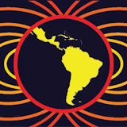
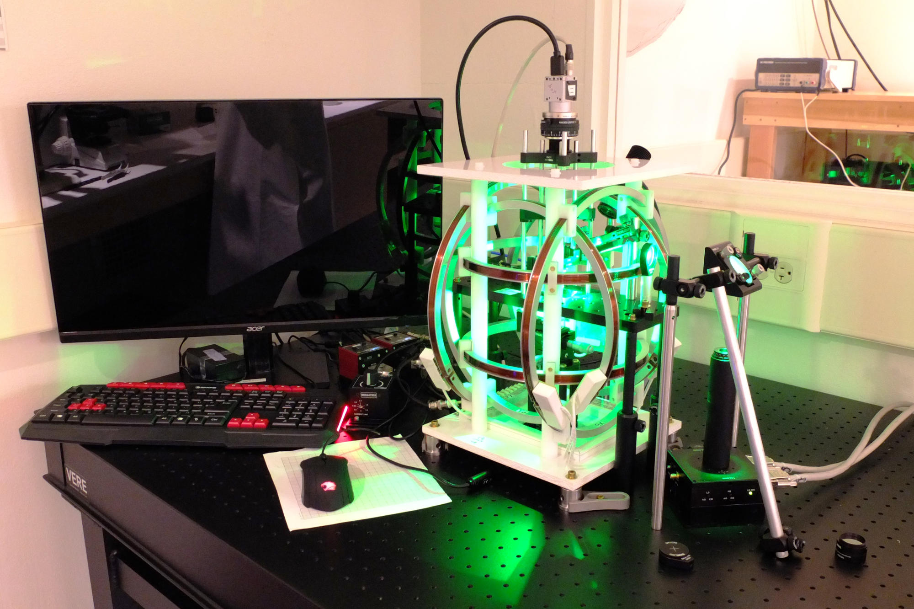

<!--
-------------------------------------------------------------------------------
This file defines the contents of each slide.
The reveal.js configuration can be found in index.html
-------------------------------------------------------------------------------
-->

<!-- .slide: class="slide-title" data-background-opacity="0.3" data-background-image="assets/magali-logo.svg" data-background-color="#000000" data-background-size="contain" -->

<!-- Place the content at the bottom of the slide -->
<div class="r-stretch">
</div>

<h1 id="talk-title">
  
  Open-source solutions for the magnetic microscopy comunity 🧲🔬

</h1>
<p id="talk-authors">
  <a id="talk-speaker">Yago M Castro</a>
</p>

<!-- Place location and date side-by-side with affiliation logos -->
<div class="row talk-info">
<div class="col-large">

<i class="fa fa-calendar-alt" style="margin: 0 10px 0 0"></i>
[DATE] October 2025
<span style="margin: 0 20px"></span>
$8^{th}$ Biennial LATINMAG Meeting | Morelia, Mexico

<!-- Permission to reuse and CC-BY license logo -->
<i class="fa fa-camera" style="margin: 0 10px 0 0"></i>
Feel free to screenshot/share/reuse this presentation
<span style="margin: 0 20px"></span>
<a href="https://creativecommons.org/licenses/by/4.0/"><i class="fab fa-creative-commons"></i><i class="fab fa-creative-commons-by" style="margin: 0 10px 0 2px"></i>CC-BY 4.0 License</a>

</div>
<div class="col-medium">

<!-- Add logos here. Need these wrappers to align them to the bottom right -->
<div class="talk-logos-container">
<div class="talk-logos">
  <a href="https://www.compgeolab.org"></a>
  <a href="https://www.iag.usp.br/"></a>
  <a href="https://www.iag.usp.br/"></a>
  <!-- <a href="https://www.usp.br/"></a> -->
</div>
</div>

</div>
</div>

===============================================================================
<div class="r-stretch">
  
</div>

===============================================================================
<div class="r-stretch">
  
</div>

===============================================================================


===============================================================================


===============================================================================

<h1>Revisiting the Assumptions</h1>

<ul>
  <li class="fragment"><b>Bellon et al. (2025)</b> tested more realistic, <b>non-equidimensional grains</b> using micromagnetic modeling</li>
  <li class="fragment">Found that <b>grain morphology stabilizes magnetization</b> even within the “magnetically unstable zone”</li>
  <li class="fragment">Assemblages of only <b>tens to hundreds of grains</b> can produce a coherent TRM direction</li>
</ul>

<div class="footnote-left">

[Bellon et al. (2025)](https://agupubs.onlinelibrary.wiley.com/doi/full/10.1029/2025GL114771)
</div>

===============================================================================


<div class="footnote-left">

[Bellon et al. (2025)](https://agupubs.onlinelibrary.wiley.com/doi/full/10.1029/2025GL114771)
</div>


===============================================================================

<!-- .slide: class="slide-title" data-background-opacity="1" data-background-image="assets/real_data.png"  data-background-size="contain" -->

===============================================================================


===============================================================================
<div class="r-stretch">

  

</div>
<br>
<div class="footnote-left">

[Harvard Paleomagnetics Lab](https://paleomag.fas.harvard.edu/laboratory)
</div>

===============================================================================
<!-- .slide: class="slide-title" data-background-opacity="1" data-background-image="assets/ceramic.png"  data-background-size="contain" -->

<div class="r-stretch">
</div>
<div class="footnote-center">

[Souza-Junior et al 2024](https://agupubs.onlinelibrary.wiley.com/doi/10.1029/2023GC011082)
</div>

===============================================================================
# Needs
<div>

- Algorithms for **automatic detection** of magnetic **grains** and its **magnetic moment** determination

</div>

===============================================================================


===============================================================================
# Needs
<div >

- Algorithms for **automatic detection** of magnetic **grains** and its **magnetic moment** determination

</div>
<div class="fragment">

- **Open software** for forward **modelling** and **inversion** techniques specific to magnetic microscopy 

</div>

<div class="fragment text-left">

- **Data conventions**  

</div>

===============================================================================
<!-- .slide: data-background-opacity="1" data-background-image="assets/readme-banner.png"  data-background-size="contain" data-background-color="#262626" -->

===============================================================================
<!-- .slide: data-background-opacity="0.2" data-background-image="assets/magali-logo.png"  data-background-size="contain" data-background-color="#262626" -->

<div class="huge ">

What is Magali?

<div class="large fragment">

Free and open source 
<br>
<i class="fab fa-github"></i> <i class="fas fa-lock-open"></i>  <i class="fab fa-osi"></i>

</div>

</div>
<div class="large fragment">

Python library <i class="fab fa-python"></i>

</div>

<div class="large fragment">

Modelling and processing magnetic microscopy data 
<br>
<i class="fas fa-magnet"></i> <i class="fas fa-microscope"></i>

</div>

===============================================================================
<!-- .slide: data-background-opacity="0.2" data-background-image="assets/magali-logo.png"  data-background-size="contain" data-background-color="#262626" -->
# Why do we want to make it?

<div class="fragment text-left">

- Provide code that is **easy to use**

</div>

<div class="fragment text-left">

- Determine the **spatial positions** of **multiple** grains

</div>
<div class="fragment text-left">

- Facilitate the creation of **synthetic data**

</div>
<div class="fragment text-left">

- Propose a standard **data format**

</div>

<div class="fragment text-left">

- Serve as a **foundation** for new methods 

</div>
<div class="fragment text-left">

- Leverage the potential of emerging **magnetic microscopy** studies

</div>


===============================================================================

<p class="text-left"> <b>Step 1 - Source Detection</b></p>
<p class="fragment text-left" data-fragment-index="2"> <b>Step 2 - Iterative processing (per window)</b></p>
<ul>
  <li class="fragment" data-fragment-index="3">(a) <strong>Isolate data</strong> – Select magnetic data inside window</li>
  <li class="fragment" data-fragment-index="4">(b) <strong>Euler deconvolution</strong> – Estimate source <em>position</em></li>
  <li class="fragment" data-fragment-index="5">(c) <strong>Linear inversion</strong> – Estimate dipole <em>moment</em> using fixed position</li>
  <li class="fragment" data-fragment-index="6">(d) <strong>Non-linear inversion</strong> – Refine position & moment via
    <span class="fragment fade-in-then-out" data-fragment-index="6"> 
      <a href="https://academic.oup.com/comjnl/article-abstract/7/4/308/354237?redirectedFrom=fulltext">Nelder-Mead</a>
    </span>
    <span class="fragment fade-in" data-fragment-index="7">
      <p>a <a href="https://academic.oup.com/comjnl/article-abstract/7/4/308/354237?redirectedFrom=fulltext">Levenberg–Marquardt-based inversion</a></p>
    </span>
  </li>
  <li class="fragment" data-fragment-index="8">(e) <strong>Signal removal</strong> – Forward model dipole & subtract from full dataset</li>
</ul>
<p class="fragment text-left" data-fragment-index="10"><b>Step 3 - Repeat detection on residual data:</b> Apply steps 1 and 2  to the stripped dataset to identify new sources and compute their parameters


===============================================================================
<!-- .slide: data-background-opacity="1" data-background-image="assets/detection.png"  data-background-size="contain" data-background-color="#262626" -->

===============================================================================


===============================================================================
```python
def test_dipole_bz_grid(souza_junior_model):
    # Use model fixture from _models.py
    data = souza_junior_model

    # Test units
    assert data.x.units == "µm"
    assert data.y.units == "µm"
    assert data.units == "nT"

    # Test array sizes
    assert data.x.size == 1001
    assert data.y.size == 1001
    assert data.size == 1002001

    # Test data name
    assert data.long_name == "vertical magnetic field"

    # Test if data is a DataArray
    assert isinstance(data.x, xr.DataArray)
    assert isinstance(data.y, xr.DataArray)
    assert isinstance(data, xr.DataArray)
```

===============================================================================
<!-- .slide: data-background-opacity="1" data-background-image="assets/documentation.png"  data-background-size="contain" data-background-color="#262626" -->

===============================================================================
<!-- .slide: data-background-opacity="1" data-background-image="assets/api.png"  data-background-size="contain" data-background-color="#262626" -->

===============================================================================
<!-- .slide: data-background-opacity="1" data-background-image="assets/doc_function.png"  data-background-size="contain" data-background-color="#262626" -->

===============================================================================
<!-- .slide: data-background-opacity="1" data-background-image="assets/fatiando-data.png"  data-background-size="contain" data-background-color="#262626" -->

===============================================================================
<!-- .slide: data-background-opacity="1" data-background-image="assets/morroco.png"  data-background-size="contain" data-background-color="#262626" -->

===============================================================================
<!-- .slide: data-background-opacity="0.2" data-background-image="assets/magali-logo.png"  data-background-size="contain" data-background-color="#262626" -->

<div class="r-stretch centered">
<div>

<i class="fas fa-comments"></i>
<br>
Contact:
<a>yagomcastro1@gmail.com</a>

<i class="fab fa-github"></i>
<br>
Source code for this presentation:
<br>
[https://yagomcastro.github.io/magali-msc-qualification/](https://github.com/YagoMCastro/magali-msc-qualification)

<i class="fab fa-creative-commons"></i><i class="fab fa-creative-commons-by"></i>
<br>
Unless otherwise noted,
the contents of this presentation are
licensed under the
<br>
[Creative Commons Attribution 4.0 International License](https://creativecommons.org/licenses/by/4.0/).

</div>
</div>